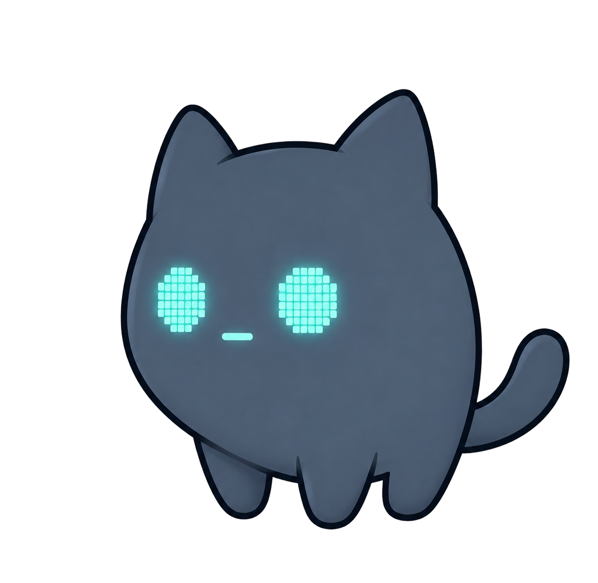

<picture>
  <source media="(prefers-color-scheme: dark)" srcset="public/camo/grey/camo_icon.png">
  
</picture>

# Camo

> 轻量桌面桌宠助手 — 陪聊、提醒、操控电脑。

[](https://v2.tauri.app)
[](https://vuejs.org)
[](https://www.typescriptlang.org)
[](https://vitejs.dev)
[](https://pinia.vuejs.org)
[](https://sql.js.org)
[](https://ollama.com)
[](https://platform.openai.com)
[](./LICENSE)

一只住在你桌面上的小助手。可以对它说「明天九点开会」，也可以让它帮你写脚本、查文件。支持 OpenAI 兼容协议和 Ollama 本地模型，所有数据离线存储。

---

## 安装

前往 [Releases](https://github.com/Wzhgeek/Camo/releases) 下载最新版本。

| 平台 | 安装包 |
|---|---|
| macOS | `.dmg`（拖入 Applications） |
| Windows | `.msi` |
| Linux | `.AppImage` / `.deb` |

首次启动后，右键桌宠 → 设置 → LLM tab 配置模型即可开始对话。也可以从源码运行：

```bash
npm install && npm start
```

---

## 功能

### LLM 对话

支持流式输出和思考过程渲染。系统提示词可自定义，让 Camo 拥有你想要的人格。

| 特性 | 说明 |
|---|---|
| 多 Provider | 内置 DeepSeek、Kimi、豆包、ChatGPT、Claude、Gemini、Ollama 等 **11 个** API 预设 |
| 会话管理 | 多会话切换、重命名、删除，自动用首条消息做标题 |
| 思考过程 | Ollama / DeepSeek 等模型的 reasoning 展开为折叠面板 |
| 停止生成 | 随时中断，不丢已输出内容 |

### 自然语言提醒

在聊天框里写人话就能创建提醒——

```
明天九点开会
每隔30分钟喝水
后天下午三点交周报
2小时后提醒我吃饭
```

支持中文数字（九点半）、阿拉伯数字（9:30）、相对时间（30 分钟后）、日期（明天/后天）。凌晨 5 点前说「明天」指当天白天。

### 提醒系统

手动模式功能更完整：

| 周期类型 | 说明 |
|---|---|
| 一次性 | 指定日期时间触发 |
| 每天 | 每天固定时刻 |
| 循环间隔 | 每 N 分钟触发一次 |
| 工作日 | 周一至周五固定时刻 |
| 周末 | 周六日固定时刻 |
| 日期范围 | start ~ end 区间内每天触发 |

触发时弹出气泡，支持**完成 / 稍后（+10 分钟）/ 跳过**三个动作。一次性提醒完成后自动禁用。

### 喝水提醒

独立于通用提醒的轻量功能。可配置间隔分钟数和活跃时段（如 09:00–22:00），面板显示实时倒计时。不依赖 LLM，即使模型离线也能工作。

### 桌宠状态动画

桌宠根据上下文自动切换形象——9 种状态、2 套主题配色、idle 时 6 帧循环动画：

```
idle → happy（被点击） → thinking（收到消息） → answering（流式输出中）
reminder / water / exercise（提醒触发）
sleepy（10 分钟无操作） → done（任务完成）
```

支持自由拖动、滚轮缩放、锁定位置、左下/右下角固定。

### 外观定制

| 维度 | 选项 |
|---|---|
| 主题 | 灰色 / 紫色 |
| 深色模式 | 自动（按时间段）/ 浅色 / 深色 |
| 字体 | 系统默认 / 衬线 / 等宽 |
| 字号 | 内容 11-20px、面板 9-26px 独立可调 |
| 状态指示器 | 圆点 / 胶囊 / 隐藏，3 种配色（默认/冷色/暖色）|
| 气泡样式 | 紧凑 / 标准 / 柔和，透明度和圆角可调 |
| 窗口行为 | 置顶、锁定、记住位置、透明度 |

### CLI

```bash
camo config                          # 交互式设置
camo config --provider ollama \
  --base-url http://localhost:11434 \
  --model qwen3.5:2b                # 命令行设置
```

配置写入 `~/.camo/config.json`，由桌面应用自动读取。

### 数据持久化

所有数据通过 sql.js (WASM SQLite) 存储，IndexedDB 做文件持久化。聊天记录、提醒、设置、好感度跨重启保留，完全离线。

---

## 项目结构

```
src/
├─ components/        # Vue 组件
│  ├─ CamoPet.vue     #   桌宠展示、拖拽、滚轮缩放
│  ├─ ChatPanel.vue   #   聊天面板、会话管理
│  ├─ ReminderBubble.vue  #   提醒触发气泡（完成/稍后/跳过）
│  ├─ ReminderPanel.vue   #   提醒管理面板
│  └─ SettingsPanel.vue   #   设置面板（LLM / 提示词 / 外观 / 系统）
├─ core/
│  ├─ agent/          # 意图识别
│  ├─ camo/           # 状态机、素材映射、主题
│  ├─ llm/            # LLM Provider（OpenAI 兼容协议 + Ollama）
│  ├─ reminder/       # 提醒解析、存储、调度引擎
│  └─ storage/        # sql.js 数据库、migrations
├─ stores/            # Pinia stores（camo / chat / reminder / settings）
├─ styles/            # 深色/浅色主题 CSS 变量
├─ App.vue            # 根组件、窗口路由、生命周期
└─ main.ts            # 入口
```

---

## 技术栈

| 层 | 技术 |
|---|---|
| 桌面框架 | [Tauri 2](https://v2.tauri.app) |
| 前端 | [Vue 3](https://vuejs.org) · [Vite](https://vitejs.dev) · [TypeScript](https://www.typescriptlang.org) |
| 状态管理 | [Pinia](https://pinia.vuejs.org) |
| 存储 | [sql.js](https://sql.js.org) (WASM SQLite) · IndexedDB |
| 图标 | [Lucide Vue Next](https://lucide.dev) |
| 样式 | CSS 变量 · 透明毛玻璃 |
| LLM | OpenAI 兼容协议 · Ollama |

## 兼容性

| 平台 | 状态 |
|---|---|
| macOS 14+ | 完全支持 |
| Windows 10+ | 完全支持 |
| Linux (Wayland/X11) | 完全支持 |

透明无边框、始终置顶。macOS 启用 `macOSPrivateApi`。浏览器预览模式下透明背景合成到渐变。

---

## 路线图

| 方向 | 状态 |
|---|---|
| LLM 对话 + 自然语言提醒 + 喝水提醒 | 已完成 |
| 外观系统、深色模式、窗口行为配置 | 已完成 |
| 好感度系统 — 桌宠记忆用户互动，语气逐渐亲密 | 已完成 |
| Camo Claw — LLM 操控电脑（读写文件、执行命令、截图、键鼠） | [规划中](./specs/camo-claw-plan.md) |

---

## 贡献

欢迎提 Issue 和 PR。新功能建议请先开 Issue 讨论，避免重复工作。

构建：

```bash
npm run build      # 仅前端
npm run package    # Tauri 桌面应用打包
```

## 许可

[MIT](./LICENSE) · [@Wzhgeek](https://github.com/Wzhgeek)
